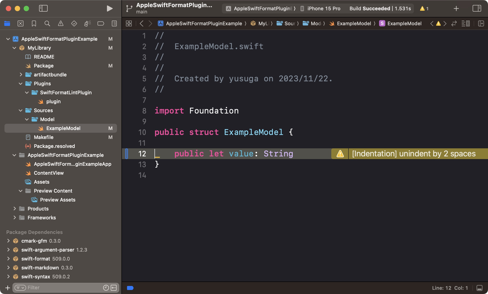

# AppleSwiftFormatPluginExample

## Overview

This repository demonstrates the implementation of Command and Build Plugins for Apple's [swift-format](https://github.com/apple/swift-format). It serves as a practical guide for integrating these plugins into your own Swift projects, showcasing easy-to-follow examples.

### Command Plugin result

```sh
$ make lint
🛠️ lint
Building for debugging...
Build complete! (1.14s)
Sources/Model/ExampleModel.swift:12:1: warning: [Indentation] unindent by 2 spaces
error: swift-format invocation failed: NSTaskTerminationReason(rawValue: 1):1
make: *** [lint] Error 1
```

### Build Plugin result



## Getting Started

### Prerequisites

- Xcode 15.0.1 or later

### Installation

Clone the repository:

```sh
$ git clone https://github.com/yourusername/AppleSwiftFormatPluginExample.git
```

Navigate to the project directory:

```sh
$ cd AppleSwiftFormatPluginExample
```

Set up the environment and open the Xcode project:

```sh
$ make app
```

### Usage

There is already one violation of swift-format, so building in Xcode will confirm that an Xcode Warning is displayed.

The Command Plugin can be executed with `$ make lint`, `$ make format`.

## Acknowledgements

### Information about artifact bundles

- [Introduction to SPM artifact bundles](https://theswiftdev.com/introduction-to-spm-artifact-bundles/)
- [Collecting SwiftPM plugin ideas for the server (but not only) ecosystem](https://forums.swift.org/t/collecting-swiftpm-plugin-ideas-for-the-server-but-not-only-ecosystem/60033/16)
- [cybozu/LicenseList / issues/Artifact Bundleをリリースに含めてほしい #4](https://github.com/cybozu/LicenseList/issues/4)

### Information about Build Plugin
    
- [karim-alweheshy/spm-build-tools](https://github.com/karim-alweheshy/spm-build-tools)    
- [realm/SwiftLint](https://github.com/realm/SwiftLint)
- [Swift Package プラグインの全体像](https://qiita.com/maiyama18/items/3d0f7b288c6858b751ce)
- [Swift Package コマンドプラグインの --allow-writing-to-(package-)directory オプションの動作](https://qiita.com/maiyama18/items/433c0a8ad52ab78a03b8)

## For a detailed explanation in Japanese

- [Multi-module 環境に swift-format を Command Plugin と Build Plugin で導入する](https://zenn.dev/yusuga/articles/857b23f4abde67)

